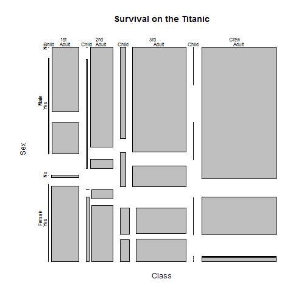

data(Titanic) による ロジスティック回帰
========================================================

## R stats::glm による統計モデル作成

- refs 
    - http://ww2.coastal.edu/kingw/statistics/R-tutorials/loglin.html


```r
data(Titanic)
# ?Titanic
dimnames(Titanic)
```

```
## $Class
## [1] "1st"  "2nd"  "3rd"  "Crew"
## 
## $Sex
## [1] "Male"   "Female"
## 
## $Age
## [1] "Child" "Adult"
## 
## $Survived
## [1] "No"  "Yes"
```

```r

require(graphics)
mosaicplot(Titanic, main = "Survival on the Titanic")
```

 

```r
margin.table(Titanic, c(2, 4))
```

```
##         Survived
## Sex        No  Yes
##   Male   1364  367
##   Female  126  344
```

```r
(odds_male_survived <- 367/1364)  # オッズ
```

```
## [1] 0.2691
```

```r
(odds_female_survived <- 344/126)  # オッズ
```

```
## [1] 2.73
```

```r
(odds_rate_F <- odds_female_survived/odds_male_survived)  # オッズ比 女性である場合、10倍の確率で生存する。
```

```
## [1] 10.15
```

```r

# 尤度比、リスク比
(344/(344 + 126))/(367/(367 + 1364))
```

```
## [1] 3.452
```

```r
# stats::glm
t <- Titanic
t.df <- data.frame(t)
names(t.df) <- tolower(names(t.df))

require("reshape2")  # data.frame 整形
```

```
## Loading required package: reshape2
```

```r
t.cast.df <- dcast(t.df, class + sex + age ~ survived, value.var = "freq")
(t.cast.df)
```

```
##    class    sex   age  No Yes
## 1    1st   Male Child   0   5
## 2    1st   Male Adult 118  57
## 3    1st Female Child   0   1
## 4    1st Female Adult   4 140
## 5    2nd   Male Child   0  11
## 6    2nd   Male Adult 154  14
## 7    2nd Female Child   0  13
## 8    2nd Female Adult  13  80
## 9    3rd   Male Child  35  13
## 10   3rd   Male Adult 387  75
## 11   3rd Female Child  17  14
## 12   3rd Female Adult  89  76
## 13  Crew   Male Child   0   0
## 14  Crew   Male Adult 670 192
## 15  Crew Female Child   0   0
## 16  Crew Female Adult   3  20
```

```r

t.glm <- glm(cbind(Yes, No) ~ class + sex + age, family = binomial, data = t.cast.df)
summary(t.glm)
```

```
## 
## Call:
## glm(formula = cbind(Yes, No) ~ class + sex + age, family = binomial, 
##     data = t.cast.df)
## 
## Deviance Residuals: 
##    Min      1Q  Median      3Q     Max  
## -4.136  -0.700   0.304   2.240   4.383  
## 
## Coefficients:
##             Estimate Std. Error z value Pr(>|z|)    
## (Intercept)    0.685      0.273    2.51    0.012 *  
## class2nd      -1.018      0.196   -5.19  2.1e-07 ***
## class3rd      -1.778      0.172  -10.36  < 2e-16 ***
## classCrew     -0.858      0.157   -5.45  5.0e-08 ***
## sexFemale      2.420      0.140   17.24  < 2e-16 ***
## ageAdult      -1.062      0.244   -4.35  1.4e-05 ***
## ---
## Signif. codes:  0 '***' 0.001 '**' 0.01 '*' 0.05 '.' 0.1 ' ' 1
## 
## (Dispersion parameter for binomial family taken to be 1)
## 
##     Null deviance: 671.96  on 13  degrees of freedom
## Residual deviance: 112.57  on  8  degrees of freedom
## AIC: 171.2
## 
## Number of Fisher Scoring iterations: 5
```

```r

# stepAICによる変数選択
t.glm <- glm(cbind(Yes, No) ~ (.)^2, family = binomial, data = t.cast.df)
require("MASS")
```

```
## Loading required package: MASS
```

```r
stepAIC(t.glm)
```

```
## Start:  AIC=70.62
## cbind(Yes, No) ~ (class + sex + age)^2
## 
##             Df Deviance   AIC
## - sex:age    1      1.7  70.3
## <none>              0.0  70.6
## - class:age  2     37.3 103.9
## - class:sex  3     65.0 129.6
## 
## Step:  AIC=70.31
## cbind(Yes, No) ~ class + sex + age + class:sex + class:age
## 
##             Df Deviance   AIC
## <none>              1.7  70.3
## - class:age  2     45.9 110.5
## - class:sex  3     76.9 139.5
```

```
## 
## Call:  glm(formula = cbind(Yes, No) ~ class + sex + age + class:sex + 
##     class:age, family = binomial, data = t.cast.df)
## 
## Coefficients:
##         (Intercept)             class2nd             class3rd  
##              22.034                0.328              -23.299  
##           classCrew            sexFemale             ageAdult  
##              -0.522                4.283              -22.762  
##  class2nd:sexFemale   class3rd:sexFemale  classCrew:sexFemale  
##              -0.068               -2.898               -1.136  
##   class2nd:ageAdult    class3rd:ageAdult   classCrew:ageAdult  
##              -1.998               22.424                   NA  
## 
## Degrees of Freedom: 13 Total (i.e. Null);  3 Residual
## Null Deviance:	    672 
## Residual Deviance: 1.69 	AIC: 70.3
```


